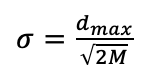
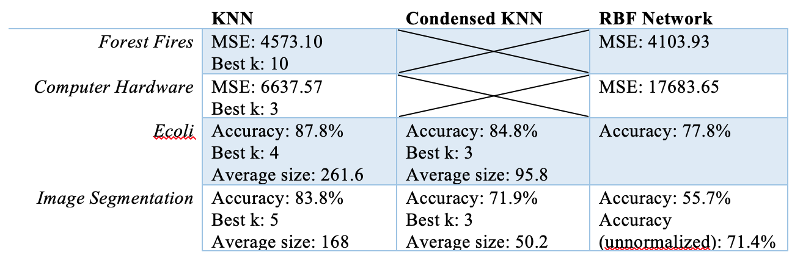

# K-Nearest-Neighbors-vs-RBF-Network

## Abstract

In this project, two algorithms – K-Nearest Neighbors and RBF Network – are experimented to solve 2 regression problems and 2 classification problems for 4 datasets obtained from the UCI Machine Learning Repository [1]. Both algorithms successfully solve all regression and classification problems. In general, the K-Nearest Neighbors algorithm performs better than the RBF Network algorithm. 

## Introduction

The main problems in this project are regression problems based on 2 datasets – “Forest Fires” and “Computer Hardware” and classification problems based on 2 datasets – “Ecoli” and “Image Segmentation”. Of the 4 datasets, only “Forest Fires” has mixed attributes. Other datasets have only continuous attributes. Also, “Ecoli” contains 8 classes while “Image Segmentation” contains 7 classes. Datasets are partitioned into 5 folds, and the performance of each model is calculated by averaging the performances from cross validation. Performance is measure by MSE for regression problems and measured by classification accuracy for classification problems.

> K-Nearest Neighbors (KNN) is a supervised, nonparametric algorithm that is rather intuitive and simple. It makes no assumptions about the distribution of the data and it predicts the target value or label of a query point simply by referring to the k neighbor points closest to the query point. Being a distance-based method, KNN is sensitive to different units of the attributes and suffers from the curse of dimensionality. To address the difference in units, all datasets are normalized before running KNN. Regarding dimensionality, “Forest Fires” and “Image Segmentation” have higher dimensionality than others, so KNN may not perform well on those datasets.

> One of the main disadvantages of KNN is that the full training set is used when making prediction on a query point. This means that the prediction is slow and an KNN model would occupy a large space to store the full training set. As an attempt to reduce the space requirement, the Condensed K-Nearest Neighbors algorithm is also implemented for the classification problems. Condensed KNN reduces the training set to a smaller subset, hopefully without losing too much information. Another disadvantage/challenge for KNN is to determine value of k (number of neighbors). In this project, k is determined with a greedy approach.

> On the other hand, RBF Network is a supervised, two-layer neural net. Using radial basis functions at the hidden layer, the resulting model is a “universal function approximator”. That is, the algorithm is able to solve non-linearly separable classification problems and learn any nonlinear function. Similar to KNN, RBF Network relies on distance measurement when calculating outputs for radial basis functions. Thus, datasets are normalized for RBF Network as well. Unlike KNN, RBF Network has many parameters that can be tuned. The width parameter (σ), the learning rate (η) for Gradient Descent, and the convergence criteria can all be tuned. Since RBF Network is a more complicated algorithm, I expect RBF Network to perform better than KNN. 

## Methods

- Data processing:

  The categorical attributes, “month” and “day” in the “Forest Fires” dataset are represented as Roman numerals. Headers are removed. Columns such as “sequence name” or “vendor name” that are not informative are dropped. There is no missing value in all datasets.

  In this project, prior to running KNN and RBF Network, a dataset is normalized and partitioned into 5 folds. The normalization makes every attribute to range between 0 and 1. The 5-fold partition can be either regular or stratified. In regular partition, instances are randomly assigned to each fold. In stratified partition, the proportion of different classes in the original training set is maintained. Instances of the same label are assigned to each fold evenly.

- K-Nearest Neighbor [2]:

  Regression and classification tasks are handled separately. For regression tasks, MSE is used as the performance measure. For classification tasks, classification accuracy is used as the performance measure. The choice of distance measure in this project is Euclidean distance. To determine the best number of neighbors (k), we test the performance of each k, and increment k until the performance stops improving.

  Condensed KNN is implemented with a greedy approach [3]. For each point in the training set, we find the closest neighbor of the point in the condensed subset. If their classes do not agree, then the point is added to the subset. This process is repeated until the subset stops changing. Since we are comparing the classes, Condensed KNN in this project is only used for classification tasks.

- RBF Network [4]:

  Again, regression and classification tasks are handled separately. For regression tasks, the final output is determined by linear combination of outputs from the hidden nodes similar to linear regression. For classification tasks, the final output is determined by multiple linear combinations of outputs from the hidden nodes. Specifically, one linear combination is calculated for each class. This class-specific value is then transformed by the sigmoid function to return a probability value. The class with the highest probability is the final output class predicted by the model. Performance is measured in the same way as that in KNN.

  In this project, the weights of the linear functions are determined by Gradient Descent. The learning rate and the convergence criteria can be tuned. The width parameter for RBF (spread) is chosen according to the maximum distance between the centers of two hidden nodes [5]. Specifically,

	

  where M is the number of hidden nodes. In this project, one hidden node is set for each data point from a random sample of 10% of the training set.

## Results

Note that Condensed KNN is only tested with classification problems. Average size is the average of all training set sizes in all 5 folds. Also note that for “Image Segmentation”, two RBF Network models are used. The first one uses a normalized dataset just like every other model in this project. The second one uses an unnormalized dataset. The results are discussed in the next section.

## References

1. Dua, D. and Karra Taniskidou, E. (2017). UCI Machine Learning Repository [http://archive.ics.uci.edu/ml]. Irvine, CA: University of California, School of Information and Computer Science.

2. Kramer, O. (2013). K-Nearest Neighbors. Dimensionality Reduction with Unsupervised Nearest Neighbors Intelligent Systems Reference Library,13-23. doi:10.1007/978-3-642-38652-7_2

3. Chou, C., Kuo, B., & Chang, F. (2006). The Generalized Condensed Nearest Neighbor Rule as A Data Reduction Method. 18th International Conference on Pattern Recognition (ICPR06). doi:10.1109/icpr.2006.1119

4. Liu, J. (2012). RBF Neural Network Control Based on Gradient Descent Algorithm. Radial Basis Function (RBF) Neural Network Control for Mechanical Systems,55-69. doi:10.1007/978-3-642-34816-7_3
5. Kim, N. (2010). Step-size control for width adaptation in radial basis function networks for nonlinear channel equalization. Journal of Communications and Networks,12(6), 600-604. doi:10.1109/jcn.2010.6388307

